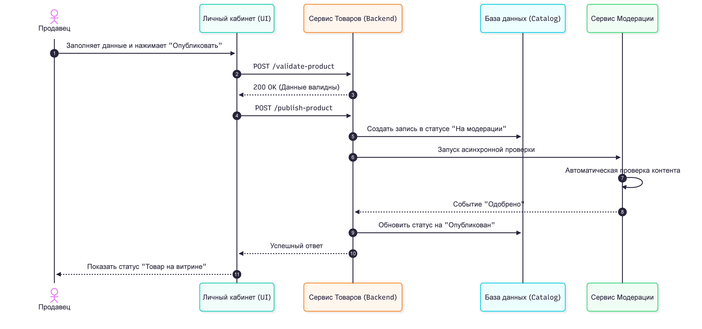
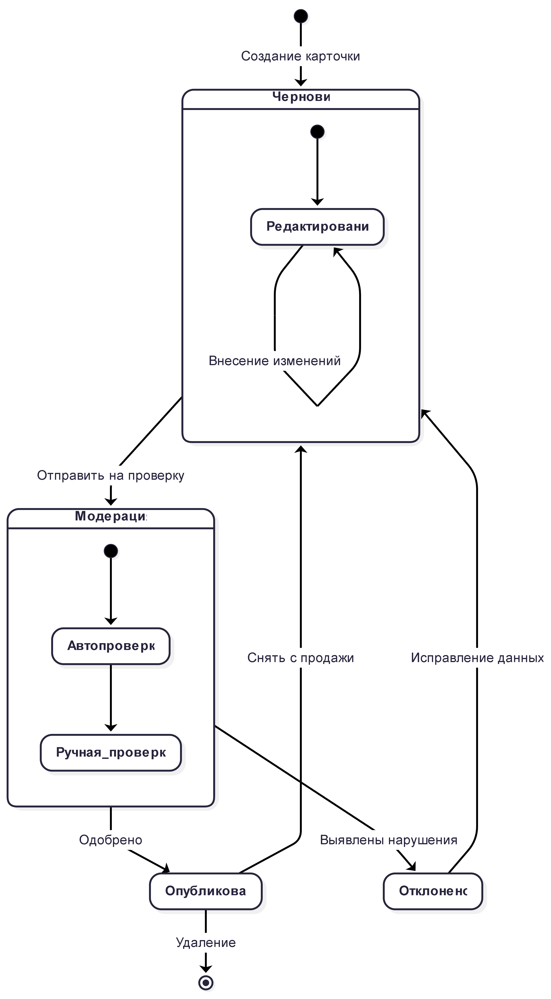

# Задача 1
- [Задача по моделе в нотации BPMN 2.0](docs/README.md)

# Задача 2: Функциональность публикации товара

##  User Story
Как продавец маркетплейса, я хочу иметь возможность публиковать свои товары на витрине, чтобы покупатели могли находить и покупать мою продукцию.

##  Use Case: Публикация товара
*   **Акторы**: Продавец, Система.
*   **Основной поток**:
    1. Продавец заполняет карточку товара и нажимает «Опубликовать».
    2. Система проверяет валидность данных.
    3. Товар сохраняется в статусе «На модерации».
    4. Запускается асинхронный процесс модерации.
    5. После одобрения статус меняется на «Опубликован», товар отображается на витрине.

##  Диаграмма взаимодействия

##  Жизненный цикл товара

# Задача 3
- [Описать REST api интерфейса и пошаговый алгоритм](docs2/README.md)

---

**Автор:** [Голубев Дмитрий]  
**Дата:** Июнь 2026
